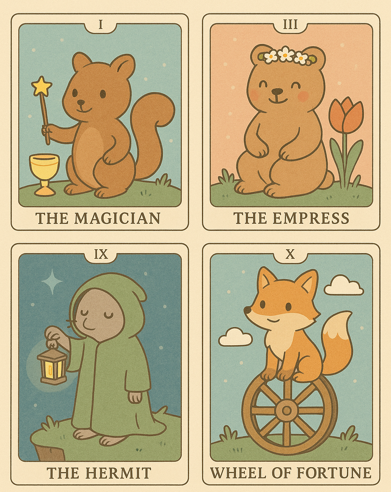

# card-deck

## **Assignment: Card Deck**

Create a digital card deck that loads data from a JSON file and displays each card on the webpage.

Your deck could be anything: a Pokémon-style collection, a tarot deck, players of a sports team, or even a set of trading cards for your favorite foods, artists, or planets.



**Requirements**

1. **Create a JSON File**
    - Update the data.json file to include your custom card deck information. It should include at least 5 cards. For example:
```json
[
  {
    "name": "The Magician",
    "number": "I",
    "image": "images/card1.png"
  },
  ...
]
```
NOTE: if you are including images, remember to create an `images` folder and add them there!

2. **Fetch Data from JSON**
- In the `script.js` file:
    - Use `fetch()` in your JavaScript file to load your JSON data.
    - Convert the response to JavaScript objects using `.json()`.
3. **Display Visual Cards**
- In the `script.js` file:
    - Complete function (e.g. `displayCards(data)`) that:
        - Loops through the array of card objects
        - For each card, creates HTML elements (e.g. a `div` with the card's name, image, and other info)
        - Appends each card to the page (e.g. inside a `.deck` container)
- In the `styles.css` file:
    - Style your cards with CSS to look like actual cards.
4. **Add Interactivity**
- In the `script.js` file:
    - Add at least one event listener to each card (e.g. clicking a card flips it, highlights it, or shows more info).
5. **(Optional) Animate with GSAP**
    - For a challenge: use GSAP to animate the cards when they appear (e.g. fade in, stagger, rotate) or on click/hover (e.g. flip the cards over).

**Submission**

1. Fork this repository (before you start coding!)
2. Use the template to create your card deck
3. Push your updates to your forked repository
4. Enable Github Pages
5. Create a Pull request